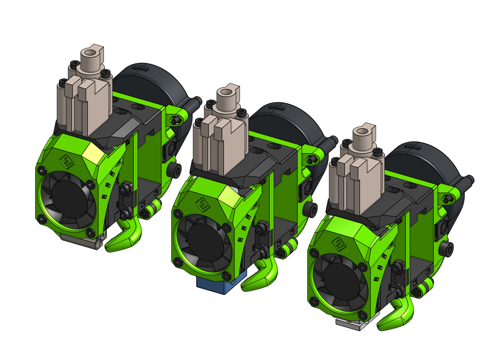
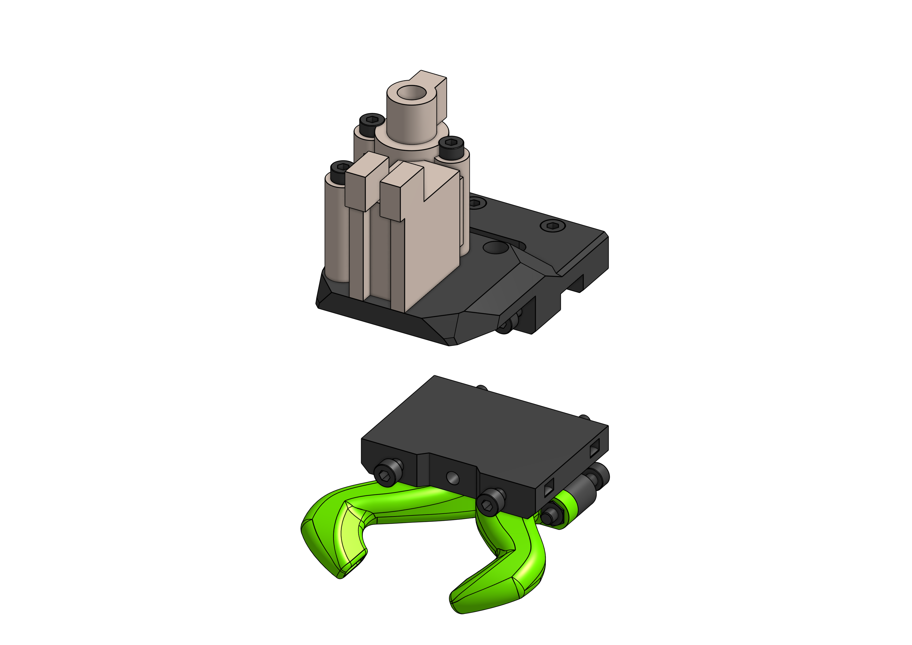

---
badges:
    - Contrib
---
# Nimble v2

Zesty Nimble v2 is one of the fancier options out there. Bowden system and direct drive combined to offer best of both worlds: lightness of a bowden and responsiveness of a direct drive. Not very popular choice. And due to high demand, very hard to get.

??? notice "MGN15"

    
    
    To mount EVA / Nimble v2 on a MGN15C carriage you will need a few different than the default parts and a few longer screws. The BOM replaces **only a few parts and screws** from the default BOM - for MGN15C you need to look at both - **what follows is not the full MGN15C BOM**.

{{ bom("drives/nimble/bom/nimble_mgn15.csv", 4) }}

### Links

{{ eva_download_button("nimble") }}

{{ eva_link("nimble") }}

{{ onshape_link("nimble") }}

### BOM

=== "E3D V6"

{{ bom("drives/nimble/bom/v6.csv", 4) }}

=== "Mosquito"

{{ bom("drives/nimble/bom/mosquito.csv", 4) }}

=== "Dragon"

{{ bom("drives/nimble/bom/dragon.csv", 4) }}