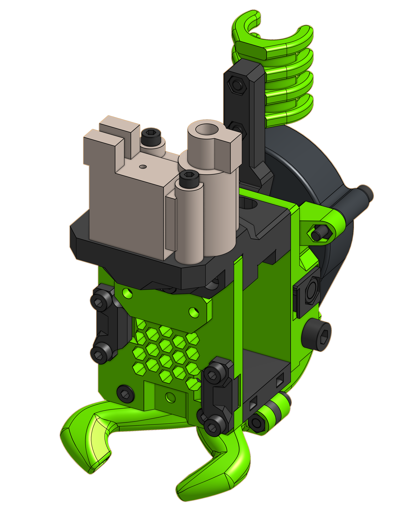

# Nimble v2

Zesty Nimble v2 is one of the fancier options out there. Bowden system and direct drive combined to offer best of both worlds: lightness of a bowden and responsiveness of a direct drive. Not very popular choice. And due to high demand, very hard to get.

### BOM

=== "MGN12"

<add-bom-button name="{{ meta.uid }} (MGN12)">
    {{ bom_to_json("Nimble.v2.MGN12.csv") }}
</add-bom-button>
{{ bom_to_md_table("Nimble.v2.MGN12", 4) }}

=== "MGN15"

<add-bom-button name="{{ meta.uid }} (MGN15)">
    {{ bom_to_json("Nimble.v2.MGN15.csv") }}
</add-bom-button>
{{ bom_to_md_table("Nimble.v2.MGN15.csv", 4) }}

#### PTFE Tube lenghts

| Hotend | Length |
| ------ | ------ |
| Mosquito | 34.8 mm |
| E3D V6 | 51.3 mm |
| Dragon | 36.3 mm |

### Links

{{ download_button }}
{{ cad_link }}

{{ repo_url }}

{{ cad_url }}